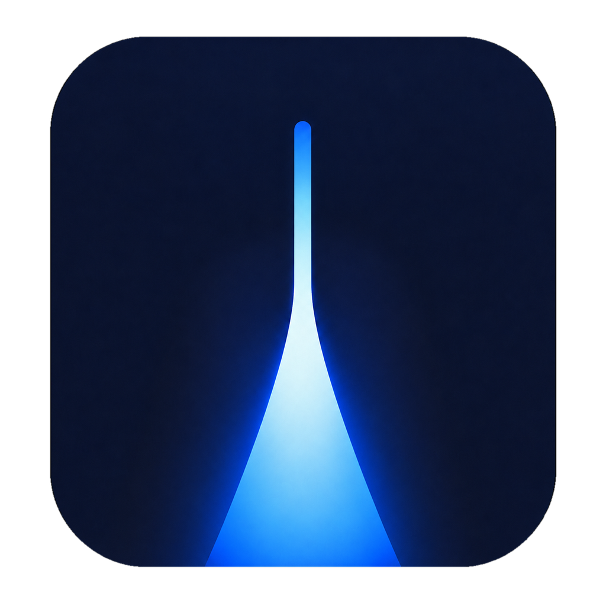

<div align="center">



# Glasslight

### A fast, keyboard-first launcher with native glass for GNOME Shell 50

[](https://github.com/eliotBenitez/glasslight/actions/workflows/ci.yml)


**English** · [Русский](README.ru.md)

Press `Alt+Space` and start typing. Launch apps, open files, do quick math,
run handy actions, and paste from your clipboard history — all without touching
the mouse.


</div>

## Why you'll like it

- **One shortcut for everything.** `Alt+Space` opens a compact bar that grows
  into results only when you need them.
- **Beautiful native glass.** Real GPU blur of your live desktop, not a fake
  gradient — and it stays crisp in light and dark themes.
- **Useful out of the box.** A calculator, timers, password generator, media
  controls and more are built in. No plugins to hunt for.
- **Private by default.** Your searches and clipboard history stay on your
  device. Nothing is sent while you type.

## A peek

| Compact launcher | Built-in calculator |
| --- | --- |
|  |  |

## Getting started

Install from source:

```sh
git clone https://github.com/eliotBenitez/glasslight.git
cd glasslight
make package
gnome-extensions install --force dist/Glasslight-GNOME-50.shell-extension.zip
```

Log out of GNOME and sign back in (this refreshes cached modules), then turn it
on:

```sh
gnome-extensions enable glasslight
```

That's it — press `Alt+Space` and go.

> **Shortcut taken?** If GNOME's window menu already uses `Alt+Space`, free it
> with `gsettings set org.gnome.desktop.wm.keybindings activate-window-menu "[]"`.

## The essentials

Just start typing to search everywhere, then use the keyboard for the rest:

| Shortcut | Action |
| --- | --- |
| `Alt+Space` | Open or close Glasslight |
| `Ctrl+0` | Return to global search |
| `Ctrl+1` … `Ctrl+4` | Apps · Files · Actions · Clipboard |
| `↑` / `↓` | Select a result |
| `←` / `→` | Navigate the application grid |
| `Alt+←` / `Alt+→` | Change application category |
| `Tab` / `Shift+Tab` | Move between controls |
| `Space` | Preview the selected file or image |
| `Enter` | Open, run, or copy the selection |
| `Esc` | Cancel the action or close Glasslight |

Want to tweak the theme, blur, clipboard history, or shortcut?

```sh
gnome-extensions prefs glasslight
```

## Good to know

- Clipboard history lives in memory only and clears when your session ends.
- A web search opens only when you pick the DuckDuckGo result — never while
  typing.
- Passwords are generated from `/dev/urandom`.
- Glasslight targets GNOME Shell **50** only, for now.

## Contributing

Bug reports and pull requests are welcome. See
[CONTRIBUTING.md](CONTRIBUTING.md) for the architecture, build commands, and
the manual-test checklist.

## Design note

Glasslight is an independent GNOME extension inspired by contemporary
translucent interfaces. It ships no Apple assets or proprietary technology; the
glass is built with GNOME Shell's own
[`Shell.BlurEffect`](https://gnome.pages.gitlab.gnome.org/gnome-shell/shell/class.BlurEffect.html)
and a custom rounded mask.
