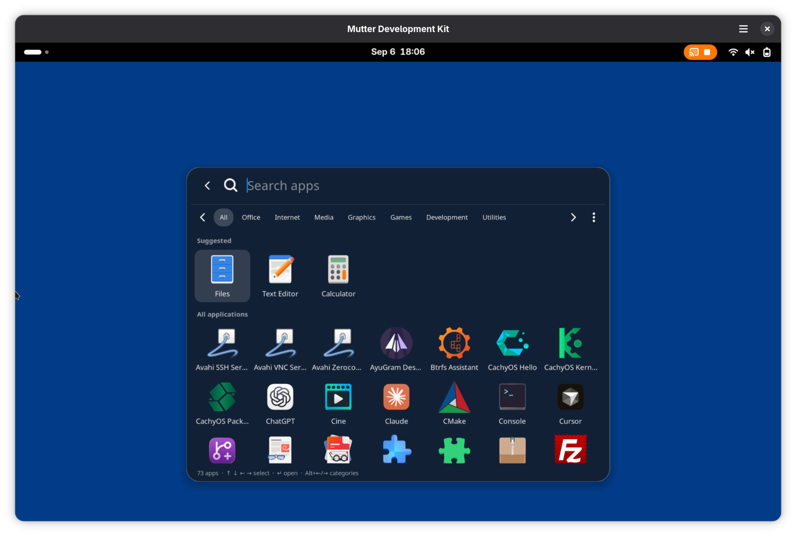
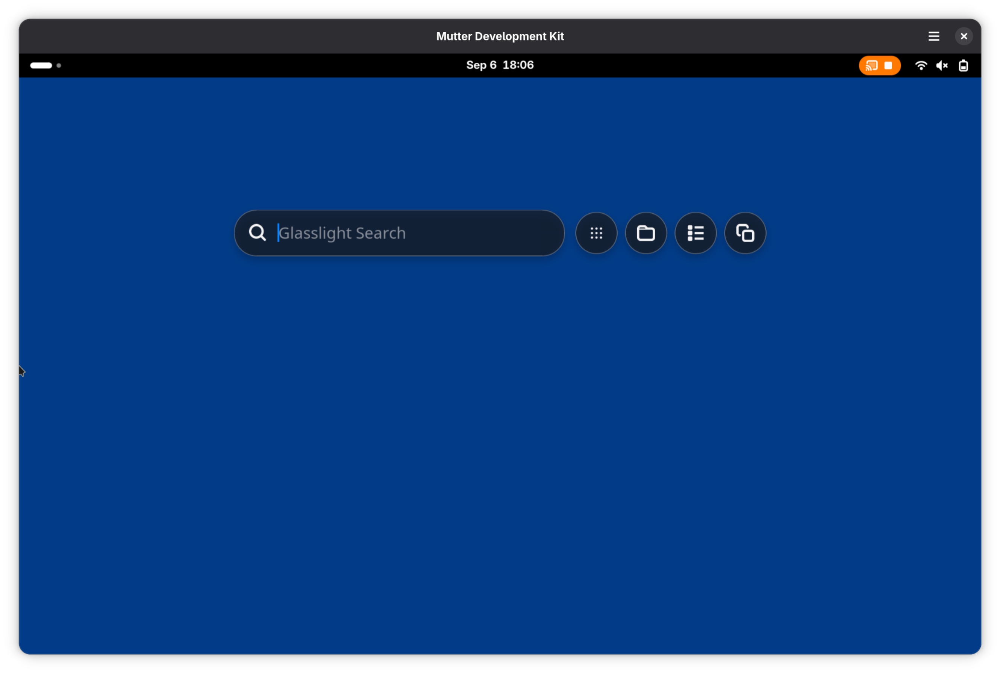
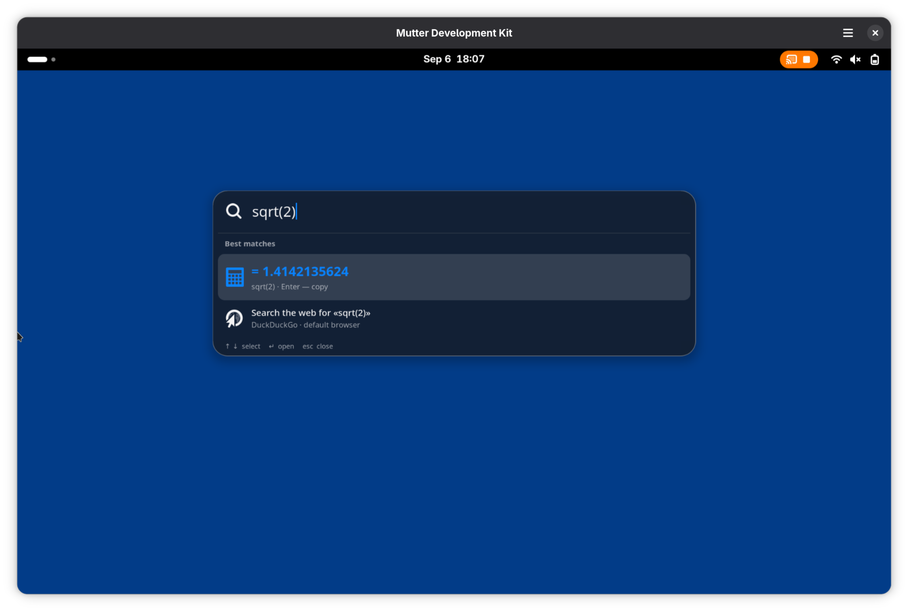

<div align="center">

# Glasslight

### Быстрый лаунчер с нативным стеклом для GNOME Shell 50

[English](README.md) · **Русский**

Нажмите `Alt+Space` и начните печатать. Запускайте приложения, открывайте файлы,
считайте выражения, выполняйте полезные действия и вставляйте из истории буфера —
всё с клавиатуры, без мыши.



</div>

## Чем понравится

- **Одна комбинация на всё.** `Alt+Space` открывает компактную строку, которая
  разворачивается в результаты только когда нужно.
- **Настоящее стекло.** GPU-размытие живого рабочего стола, а не поддельный
  градиент — и остаётся чётким в светлой и тёмной теме.
- **Полезен сразу.** Калькулятор, таймеры, генератор паролей, управление
  медиа и другое встроены. Плагины искать не нужно.
- **Приватность по умолчанию.** Поиск и история буфера остаются на устройстве.
  Пока вы печатаете, ничего не отправляется.

## Как выглядит

| Компактная строка | Встроенный калькулятор |
| --- | --- |
|  |  |

## С чего начать

Сборка из исходников:

```sh
git clone https://github.com/eliotBenitez/glasslight.git
cd glasslight
make package
gnome-extensions install --force dist/Glasslight-GNOME-50.shell-extension.zip
```

Выйдите из сеанса GNOME и войдите снова (это сбрасывает кеш модулей), затем
включите расширение:

```sh
gnome-extensions enable glasslight
```

Готово — нажимайте `Alt+Space`.

> **Комбинация занята?** Если `Alt+Space` уже использует меню окна GNOME,
> освободите его: `gsettings set org.gnome.desktop.wm.keybindings activate-window-menu "[]"`.

## Основное

Просто начните печатать — поиск идёт везде, а дальше всё делается с клавиатуры:

| Клавиши | Действие |
| --- | --- |
| `Alt+Space` | Открыть или закрыть Glasslight |
| `Ctrl+0` | Вернуться в общий поиск |
| `Ctrl+1` … `Ctrl+4` | Приложения · Файлы · Действия · Буфер |
| `↑` / `↓` | Выбрать результат |
| `←` / `→` | Навигация по сетке приложений |
| `Alt+←` / `Alt+→` | Сменить категорию приложений |
| `Tab` / `Shift+Tab` | Переход между элементами |
| `Enter` | Открыть, выполнить или скопировать |
| `Esc` | Отменить действие или закрыть Glasslight |

Хотите изменить тему, силу размытия, историю буфера или сочетание клавиш?

```sh
gnome-extensions prefs glasslight
```

## Полезно знать

- История буфера хранится только в памяти и очищается при завершении сеанса.
- Веб-поиск открывается только при выборе строки DuckDuckGo — не при наборе.
- Пароли генерируются из `/dev/urandom`.
- Пока поддерживается только GNOME Shell **50**.

## Участие в проекте

Отчёты об ошибках и pull request'ы приветствуются. Архитектура, команды сборки
и чек-лист ручной проверки — в [CONTRIBUTING.md](CONTRIBUTING.md).

## О дизайне

Glasslight — независимое расширение GNOME, вдохновлённое современными
полупрозрачными интерфейсами. Оно не содержит ресурсов Apple и закрытых
технологий; стекло построено на собственном
[`Shell.BlurEffect`](https://gnome.pages.gitlab.gnome.org/gnome-shell/shell/class.BlurEffect.html)
GNOME Shell и скруглённой маске.
